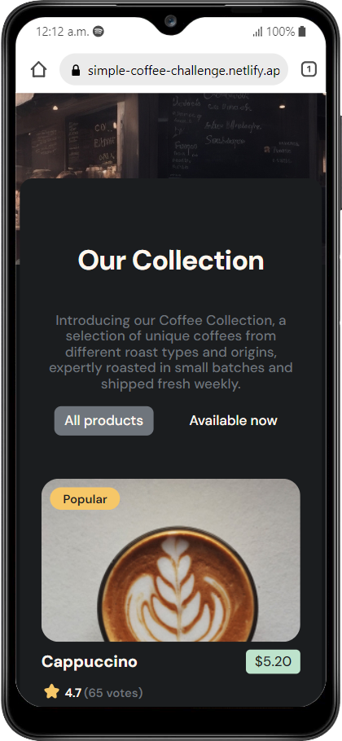
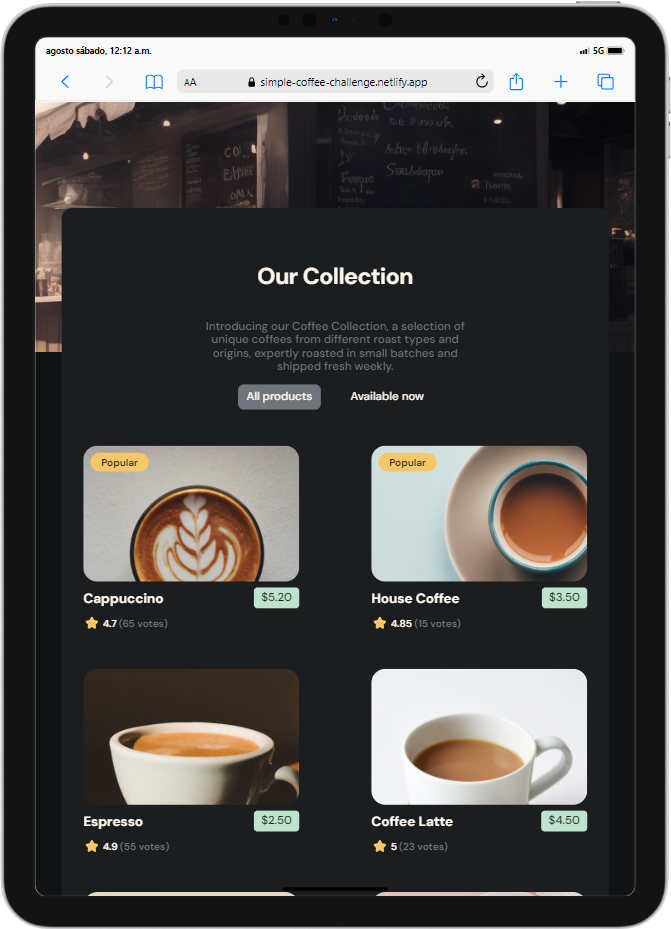
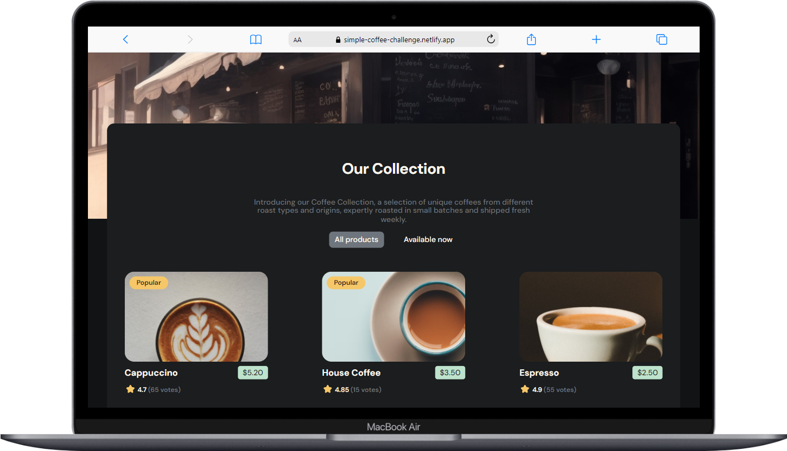

# DevChallenges.io - Simple Coffee Listing

Este proyecto es una solución al Simple Coffee Listing de [devchallenges.io](https://devchallenges.io/challenge/simple-coffee-listing). El objetivo de este desafío es poner en práctica los conceptos básicos de frontend utilizando algún framework o libreria.

## Índice

- [Descripción](#descripción)
- [Tecnologías utilizadas](#tecnologías-utilizadas)
- [Instalación y configuración](#instalación-y-configuración)
- [Capturas de pantalla](#capturas-de-pantalla)

## Descripción

Este desafio lo realice con el objetivo de familiarizarme con el framework partiendo desde un nivel básico.

Aprendí la nueva sintaxis de Angular 17 como @if @else y @for entre otras.

## Tecnologías utilizadas

- **Angular 17**: Framework principal para la construcción de la aplicación.

## Instalación y configuración

Para ejecutar este proyecto localmente, sigue los siguientes pasos:

1. Clona este repositorio:
    ```bash
    git clone https://github.com/Jcarrizoagustin/simple-coffee-listing-challenge.git
    ```
2. Navega al directorio del proyecto:
    ```bash
    cd simple-coffee-listing
    ```
3. Instala las dependencias:
    ```bash
    npm install
    ```
4. Inicia la aplicación:
    ```bash
    npm start
    ```
5. Abre tu navegador y visita `http://localhost:4200` para ver la aplicación en funcionamiento.

## Capturas de pantalla



